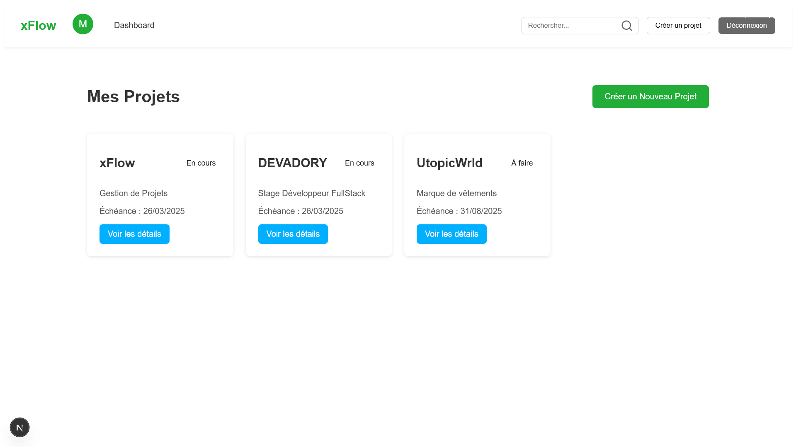

# Projet de Niveau 1 - Dashboard de Gestion de Projets

## Description

Ce projet représente l'interface de gestion de projets pour les utilisateurs. L'application permet à l'utilisateur de se connecter, d'afficher la liste de ses projets, de créer un nouveau projet et de consulter les détails des projets existants. L'application utilise React et Parse pour la gestion des données et des utilisateurs.

## Fonctionnalités

- **Dashboard des projets** : Affichage de la liste des projets associés à un utilisateur.
- **Création de projet** : Permet à un utilisateur de créer un nouveau projet.
- **Détails du projet** : L'utilisateur peut consulter les détails de chaque projet.
- **Gestion des utilisateurs** : Les utilisateurs doivent se connecter avant de voir ou de créer des projets.
- **Composants dynamiques** : Basé sur React pour une expérience utilisateur fluide.

## Prérequis

Avant de commencer, vous devez avoir installé les outils suivants sur votre machine :

- **Node.js** (version 15.x ou supérieure) : [Télécharger Node.js](https://nodejs.org/)

## Installation

### 1. Cloner le dépôt

Clonez ce dépôt sur votre machine locale en utilisant la commande suivante :

```bash
git clone https://github.com/yourusername/votre-depot.git
```

### 2. Installer les dépendances

Naviguez dans le dossier du projet et installez les dépendances nécessaires avec npm :

```bash
cd votre-depot
npm install
```

### 3. Configuration de Parse

L'application utilise Parse pour gérer les utilisateurs et les projets. Suivez ces étapes pour configurer Parse :

Créez un compte sur Parse.

Créez une application dans le tableau de bord de Parse et récupérez votre APP_ID et SERVER_URL.

Configurez Parse dans votre application en remplaçant les valeurs suivantes dans le code de votre projet :

APP_ID : Remplacez cette valeur par l'ID de votre application Parse.

SERVER_URL : L'URL de votre serveur Parse.

### 4. Démarrer l'application

Une fois tout configuré, démarrez l'application avec la commande suivante :

```bash
npm run dev
```

Cela lancera l'application en mode développement, accessible via <http://localhost:3000>.

## Structure du projet

Voici la structure du projet :

```php
votre-depot/
│
├── components/             # Composants React (Navbar, ProjectCard, etc.)
├── lib/                    # Librairies et utilitaires (Parse, etc.)
├── pages/                  # Pages Next.js (Dashboard, Login, etc.)
├── public/                 # Dossier pour les images et fichiers statiques
├── styles/                 # Fichiers SCSS/CSS
├── .gitignore              # Fichier pour ignorer certains fichiers/dossiers
├── package.json            # Fichier de gestion des dépendances
└── README.md               # Ce fichier
```

## Capture d'écran

Voici une capture d'écran du dashboard des projets :


## Auteurs

@Yacine Samba
